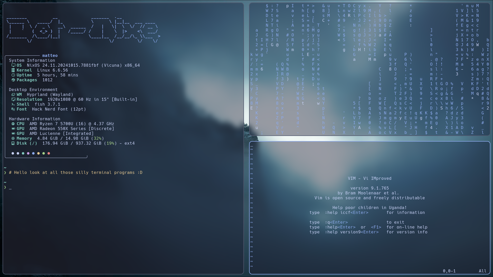
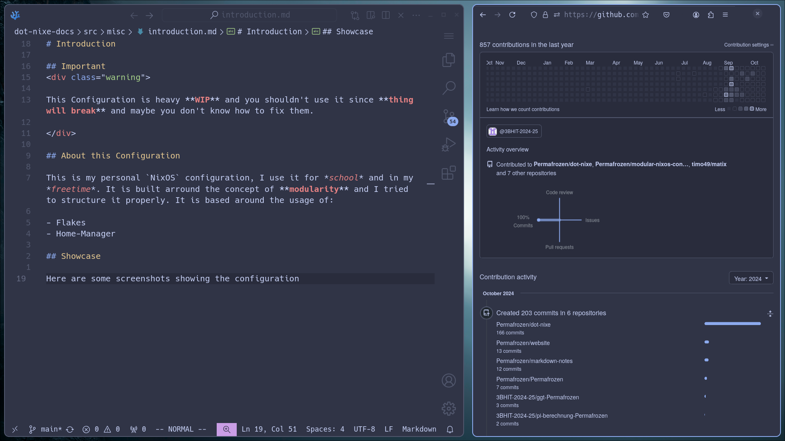
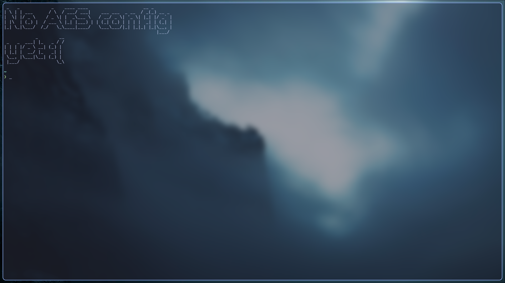

# Introduction

## Important

This Configuration is heavy **WIP** and you shouldn't use it since **thing will break** and maybe you don't know how to fix them.

## About this Configuration

This is my personal `NixOS` configuration, I use it for *school* and in my *freetime*. It is built arround the concept of **modularity** and I tried to structure it properly. It is based around the usage of:

- Flakes
- Home-Manager
- Stylix (optional)

## Showcase
 
 
 