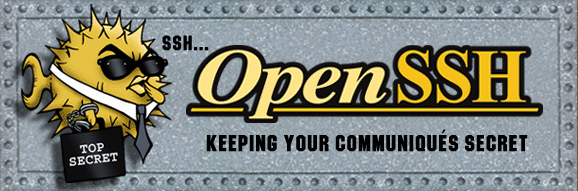

# SSH

Timo Hummer und Matteo Garbardi

---

## Was ist SSH?

- Secure Shell (SSH)
- ersetzte Klartextprotokolle (`telnet`)
- Sicheres Protokoll für Client-Server-Verbindungen
- Ermöglicht verschlüsselte Kommunikation über unsichere Netzwerke

---

## OpenSSH Suite

- Meist benutzte Implementation von `ssh-2`
- Besteht aus Server und Client
- Von den Entwicklern des `OpenBSD`-Projekt

---

## Verbindungsaufbau

1. Client initiiert TCP-Verbindung (meist Port 22)
2. Server reagiert und beginnt Handshake-Prozess
3. `...`

--

---

## SSH Paket Header

Bestandteile:

- packet length
- padding length
- payload
- random padding
- mac (Message Authentication Code)

--

---

## Protokoll- und Algorithmusverhandlung

- Server sendet Liste unterstützter Versionen und Algorithmen
- Client wählt kompatible Optionen
- Einigung auf Protokollversion und Verschlüsselungsmethoden

---

## Protokollversions-Austausch

Format: `SSH-protoversion-softwareversion SP comments CR LF`

- Protoversion: "2.0"
- Softwareversion: US-ASCII, max. 255 Zeichen
- Comments: Optional

---

## Schlüsselaustausch

- Austausch von Verschlüsselungsalgorithmus-Präferenzen
- Sicherer Algorithmus (z.B. Diffie-Hellman) für Sitzungsschlüssel
- Server-Authentifizierung mittels öffentlichem Schlüssel

---

## Sitzungsverschlüsselung

- Gemeinsamer Sitzungsschlüssel für symmetrische Verschlüsselung
- Sichert die gesamte folgende Kommunikation

---

## Sitzungsanfrage und Interaktion

- Client fordert spezifische Dienste an
- Server verarbeitet Anfragen
- Einrichtung von Kommunikationskanälen

---

## Benutzerauthentifizierung

Methoden:

- Passwort-Authentifizierung
- Public-Key-Authentifizierung
- Mehrfaktor-Authentifizierung

---

## Komprimierung

- Nur Payload-Feld wird komprimiert
- Methoden: none, zlib
- Max. Payload-Größe: 32768 Bytes
- Max. Paketgröße: 35000 Bytes (variabel)

---

## Verschlüsselung

- Aushandlung während Schlüsselaustausch
- Unabhängige Verschlüsselung in beide Richtungen
- Mindestens 128-Bit-Schlüssel empfohlen

---

## Verschlüsselungsmethoden

- 3des-cbc (veraltet)
- aes128/192/256-cbc
- blowfish-cbc, twofish-cbc, serpent-cbc
- idea-cbc, cast128-cbc, arcfour
- none (nicht empfohlen)

---

## Praktisches Beispiel

- Verbindung zwischen Client und Server (Laptops)

- **Verwendete Software:**
  - `open ssh 9.9/9.9p1`
  - `NixOS` (Server und Client)
  - lokales Netzwerk

## Quellen

- **RFC 4253:** https://www.rfc-editor.org/rfc/rfc4253
- **OpenSSH:** https://www.openssh.com/manual.html
- **reveal.js:** https://revealjs.com/